```mermaid
gantt
    title Quote Master Pro - Complete Implementation Timeline
    dateFormat  YYYY-MM-DD
    section Week 1: Foundation
    Phase 1: Enhanced AI Service     :active, p1, 2024-08-07, 4d
    Phase 2: Testing Infrastructure  :p2, after p1, 5d
    
    section Week 2: Security & Core
    Phase 3: Security & Middleware   :p3, after p2, 4d  
    Phase 4: Business Logic Services :p4, after p3, 6d
    
    section Week 3: Data & Frontend
    Phase 5: Data Access Layer       :p5, after p4, 4d
    Phase 6: Frontend Optimization   :p6, after p5, 5d
    
    section Week 4: Production Ready
    Phase 7: DevOps & Deployment     :p7, after p6, 5d
    Phase 8: Monitoring & Observability :p8, after p7, 4d
    Phase 9: Documentation           :p9, after p8, 3d
    
    section Milestones
    Foundation Complete              :milestone, m1, after p2, 0d
    Backend Secure & Complete        :milestone, m2, after p4, 0d  
    Full-Stack Optimized            :milestone, m3, after p6, 0d
    Production Ready                :milestone, m4, after p9, 0d
```

```mermaid
graph TB
    subgraph "Current State Analysis"
        A[AI Service Layer ✅] --> B[FastAPI Backend ✅]
        B --> C[React Frontend ✅] 
        C --> D[Database Models ✅]
        D --> E[Basic Testing 📋]
    end
    
    subgraph "Phase 1-2: Foundation"
        F[Enhanced AI Service] --> G[95% Test Coverage]
        G --> H[Quality Gates]
    end
    
    subgraph "Phase 3-4: Security & Core"
        I[Enterprise Security] --> J[Business Logic]
        J --> K[Domain Services]
    end
    
    subgraph "Phase 5-6: Data & Frontend"  
        L[Repository Pattern] --> M[Frontend Optimization]
        M --> N[PWA Features]
    end
    
    subgraph "Phase 7-9: Production"
        O[DevOps Pipeline] --> P[Monitoring Stack]
        P --> Q[Documentation]
    end
    
    E --> F
    H --> I
    K --> L  
    N --> O
    Q --> R[Production Ready 🚀]
    
    style A fill:#90EE90
    style B fill:#90EE90  
    style C fill:#90EE90
    style D fill:#90EE90
    style E fill:#FFE4B5
    style R fill:#FFD700
```

```mermaid
flowchart LR
    subgraph "Implementation Options"
        A[Full Implementation<br/>9 Phases - 4 Weeks<br/>Enterprise Platform] 
        B[MVP Focus<br/>4 Phases - 2 Weeks<br/>Secure Deployable MVP]
        C[Phase-by-Phase<br/>Iterative Approval<br/>4-6 Weeks Controlled]
    end
    
    A --> D[✅ Complete Production Platform<br/>✅ 99.9% Uptime Capability<br/>✅ Enterprise Features<br/>✅ Full Observability]
    
    B --> E[✅ Core Functionality<br/>✅ Security Hardened<br/>✅ Deployable<br/>❌ Limited Features]
    
    C --> F[✅ Risk Mitigation<br/>✅ Stakeholder Control<br/>✅ Quality Validation<br/>❌ Longer Timeline]
    
    style A fill:#90EE90
    style B fill:#FFE4B5  
    style C fill:#87CEEB
    style D fill:#FFD700
    style E fill:#DDA0DD
    style F fill:#F0E68C
```




