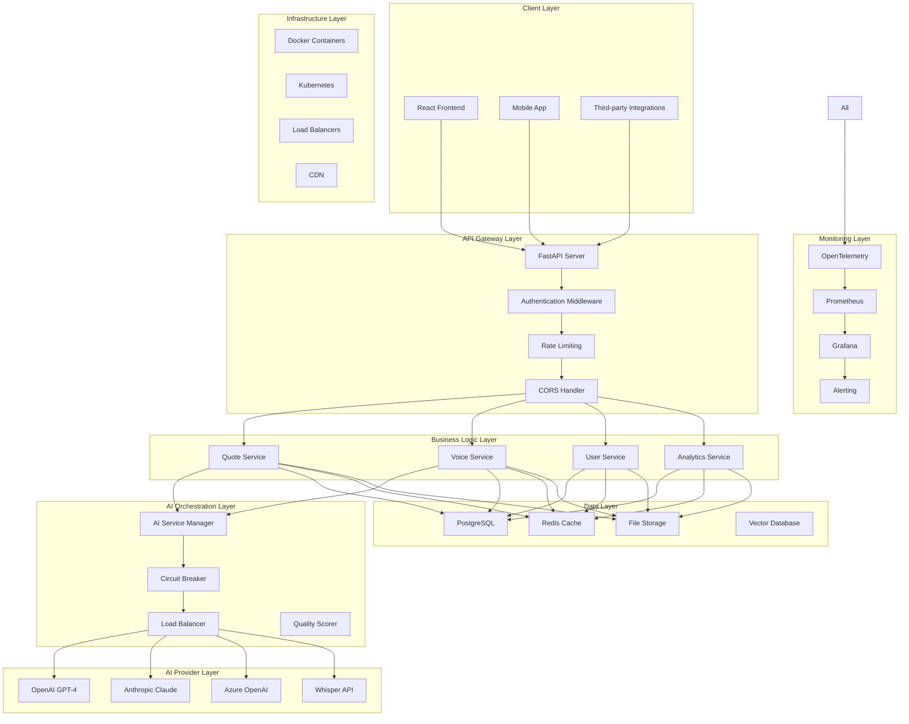
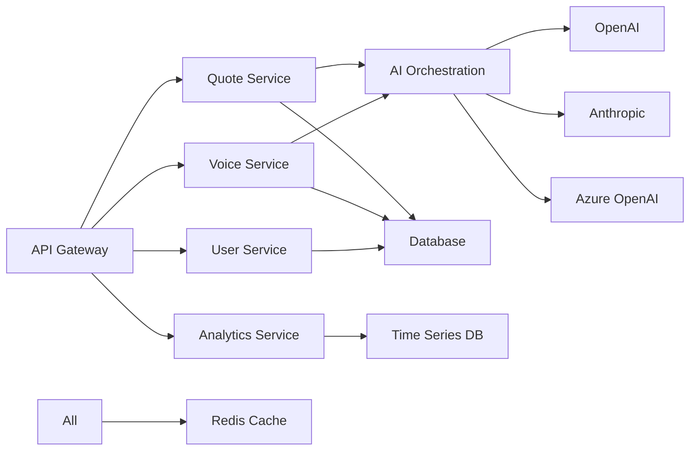
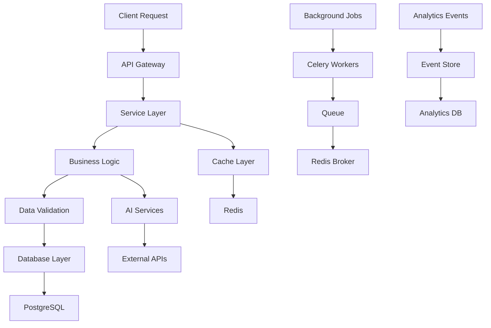
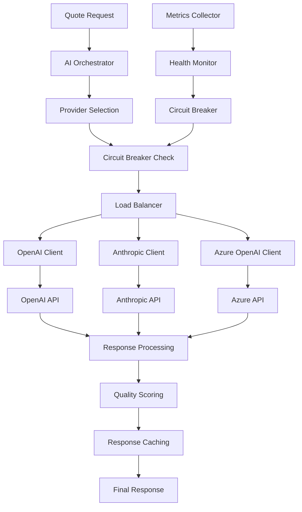
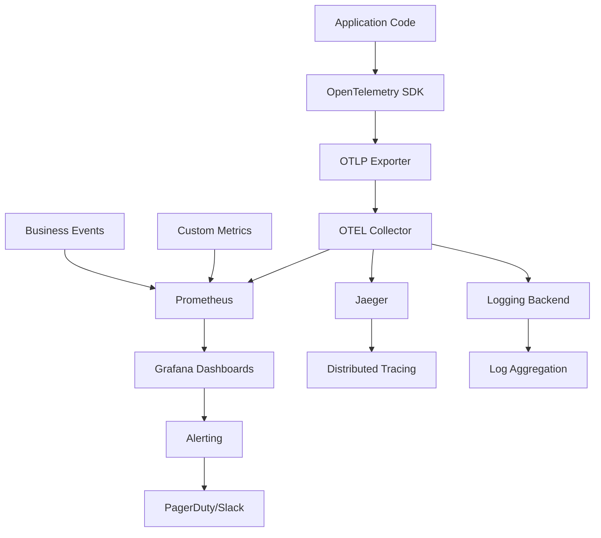
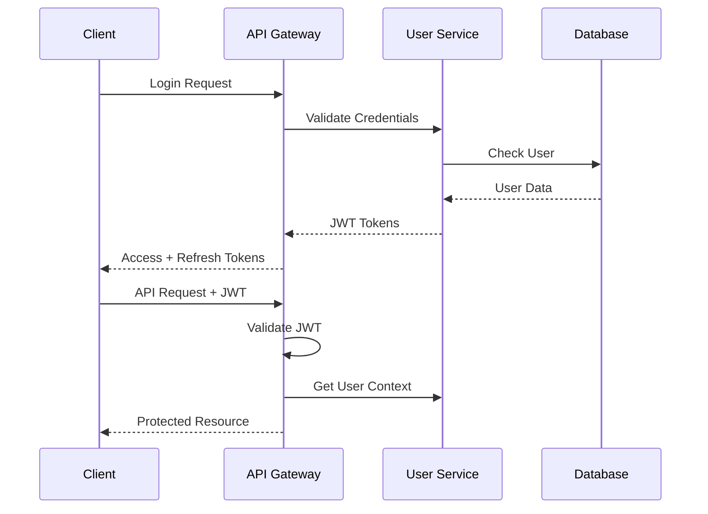
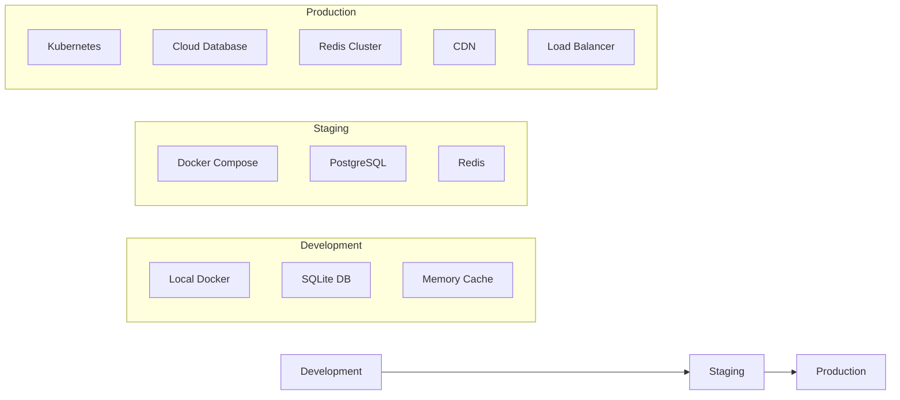
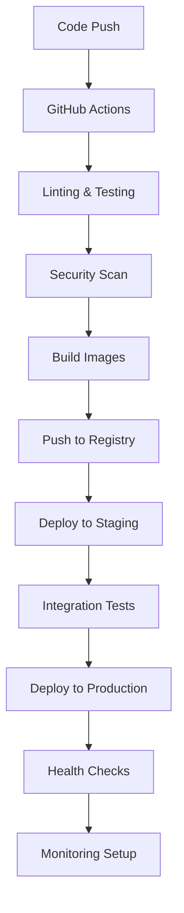

# Quote Master Pro - Architecture Documentation

## 📋 Table of Contents

- [🏗️ System Architecture](#️-system-architecture)
- [🔧 Technical Stack](#-technical-stack)
- [📦 Service Architecture](#-service-architecture)
- [🗄️ Data Architecture](#️-data-architecture)
- [🔄 AI Service Orchestration](#-ai-service-orchestration)
- [📊 Monitoring & Observability](#-monitoring--observability)
- [🔐 Security Architecture](#-security-architecture)
- [🚀 Deployment Architecture](#-deployment-architecture)

---

## 🏗️ System Architecture

### **High-Level Architecture**



### **Architectural Principles**

1. **Microservices-Ready**: Modular design for independent scaling
2. **API-First**: RESTful APIs with OpenAPI documentation
3. **Event-Driven**: Async processing with message queues
4. **Resilient**: Circuit breakers, retries, and graceful degradation
5. **Observable**: Comprehensive logging, metrics, and tracing
6. **Secure**: JWT authentication, input validation, and encryption

---

## 🔧 Technical Stack

### **Backend Stack**

| Component | Technology | Version | Purpose |
|-----------|------------|---------|---------|
| **Web Framework** | FastAPI | 0.104+ | High-performance async API |
| **Language** | Python | 3.11+ | Core backend language |
| **Data Validation** | Pydantic | 2.5+ | Request/response validation |
| **ORM** | SQLAlchemy | 2.0+ | Database object mapping |
| **Migration** | Alembic | 1.13+ | Database schema migrations |
| **Testing** | Pytest | 7.4+ | Test framework |
| **Code Quality** | Black, isort, flake8 | Latest | Code formatting & linting |
| **Type Checking** | MyPy | 1.7+ | Static type checking |

### **Frontend Stack**

| Component | Technology | Version | Purpose |
|-----------|------------|---------|---------|
| **Framework** | React | 18+ | UI framework |
| **Language** | TypeScript | 5.2+ | Type-safe JavaScript |
| **Build Tool** | Vite | 4.5+ | Fast build tool |
| **Styling** | Tailwind CSS | 3.3+ | Utility-first CSS |
| **Animation** | Framer Motion | 10+ | Animation library |
| **State** | React Query | 5+ | Server state management |
| **Router** | React Router | 6+ | Client-side routing |
| **HTTP Client** | Axios | 1.6+ | HTTP requests |

### **AI & ML Stack**

| Component | Technology | Purpose |
|-----------|------------|---------|
| **LLM Providers** | OpenAI GPT-4, Anthropic Claude | Text generation |
| **Speech Recognition** | OpenAI Whisper | Voice-to-text |
| **Psychology Analysis** | Custom Models | Emotional analysis |
| **Vector Storage** | Chroma/Pinecone | Semantic search |
| **ML Pipeline** | Scikit-learn | Data processing |

### **Infrastructure Stack**

| Component | Technology | Purpose |
|-----------|------------|---------|
| **Containerization** | Docker | Application packaging |
| **Orchestration** | Docker Compose | Local development |
| **Database** | PostgreSQL 15+ | Primary database |
| **Cache** | Redis 7+ | Caching & sessions |
| **Message Queue** | Celery + Redis | Background tasks |
| **File Storage** | AWS S3 / Local | File storage |
| **Monitoring** | OpenTelemetry, Prometheus | Observability |

---

## 📦 Service Architecture

### **Core Services**

#### **1. API Gateway Service**
- **Purpose**: Single entry point for all client requests
- **Responsibilities**: Authentication, rate limiting, request routing
- **Technology**: FastAPI with custom middleware
- **Scaling**: Horizontal scaling with load balancer

#### **2. Quote Generation Service**
- **Purpose**: Orchestrate AI-powered quote generation
- **Responsibilities**: Prompt engineering, quality scoring, caching
- **Technology**: FastAPI + AI orchestration layer
- **Scaling**: Auto-scaling based on request volume

#### **3. Voice Processing Service**
- **Purpose**: Handle voice-to-text and voice-to-quote workflows
- **Responsibilities**: Audio processing, transcription, integration
- **Technology**: FastAPI + Whisper AI + FFmpeg
- **Scaling**: Queue-based processing with workers

#### **4. User Management Service**
- **Purpose**: Handle user authentication and authorization
- **Responsibilities**: JWT tokens, user profiles, preferences
- **Technology**: FastAPI + SQLAlchemy + JWT
- **Scaling**: Stateless design for horizontal scaling

#### **5. Analytics Service**
- **Purpose**: Track usage and provide insights
- **Responsibilities**: Event tracking, reporting, dashboards
- **Technology**: FastAPI + Time-series database
- **Scaling**: Event-driven with async processing

### **Service Communication**



---

## 🗄️ Data Architecture

### **Database Schema**

#### **Core Entities**

```sql
-- Users table
CREATE TABLE users (
    id UUID PRIMARY KEY,
    email VARCHAR(255) UNIQUE NOT NULL,
    username VARCHAR(100),
    hashed_password VARCHAR(255) NOT NULL,
    full_name VARCHAR(255),
    role user_role DEFAULT 'user',
    is_active BOOLEAN DEFAULT true,
    is_verified BOOLEAN DEFAULT false,
    created_at TIMESTAMP DEFAULT NOW(),
    updated_at TIMESTAMP DEFAULT NOW()
);

-- Quotes table
CREATE TABLE quotes (
    id UUID PRIMARY KEY,
    user_id UUID REFERENCES users(id),
    text TEXT NOT NULL,
    author VARCHAR(255),
    source quote_source DEFAULT 'ai_generated',
    ai_model VARCHAR(100),
    psychological_profile JSONB,
    emotional_tone VARCHAR(50),
    sentiment_score FLOAT,
    quality_score FLOAT,
    created_at TIMESTAMP DEFAULT NOW()
);

-- Voice recordings table
CREATE TABLE voice_recordings (
    id UUID PRIMARY KEY,
    user_id UUID REFERENCES users(id),
    file_path VARCHAR(500),
    transcription TEXT,
    duration_seconds INTEGER,
    file_size_bytes BIGINT,
    status processing_status DEFAULT 'pending',
    created_at TIMESTAMP DEFAULT NOW()
);
```

### **Data Flow Architecture**



### **Caching Strategy**

| Data Type | Cache Layer | TTL | Invalidation |
|-----------|-------------|-----|-------------|
| **User Sessions** | Redis | 30 min | On logout/token refresh |
| **AI Responses** | Redis | 1 hour | Manual/time-based |
| **Static Content** | CDN | 24 hours | On deployment |
| **Database Queries** | Application | 5 min | On data change |
| **API Rate Limits** | Redis | 1 hour | Time window based |

---

## 🔄 AI Service Orchestration

### **AI Service Architecture**



### **Provider Selection Logic**

```python
class ProviderSelectionStrategy:
    """Intelligent AI provider selection."""

    def select_provider(self, request):
        factors = {
            'response_time': self.get_avg_response_time(),
            'success_rate': self.get_success_rate(),
            'cost_per_token': self.get_cost_metrics(),
            'circuit_breaker_state': self.get_circuit_state(),
            'rate_limit_status': self.get_rate_limit_status()
        }

        return self.weighted_selection(factors)
```

### **Circuit Breaker Implementation**

- **Failure Threshold**: 5 failures in 60 seconds
- **Recovery Timeout**: 30 seconds
- **Half-Open State**: Limited requests for testing
- **Metrics Tracking**: Success/failure rates, response times

---

## 📊 Monitoring & Observability

### **Observability Stack**



### **Key Metrics**

#### **Application Metrics**
- Request rate, response time, error rate
- Database connection pool usage
- Cache hit/miss ratios
- Queue depths and processing times

#### **Business Metrics**
- Quote generation rate
- User engagement metrics
- AI service costs and ROI
- Voice processing success rates

#### **Infrastructure Metrics**
- CPU, memory, disk usage
- Network I/O and latency
- Database performance
- Container health and restarts

### **Alerting Rules**

```yaml
groups:
  - name: quote_master_alerts
    rules:
      - alert: HighErrorRate
        expr: rate(http_requests_total{status=~"5.."}[5m]) > 0.05
        for: 2m
        labels:
          severity: critical
        annotations:
          summary: High error rate detected

      - alert: AIServiceDown
        expr: ai_service_health{provider="openai"} == 0
        for: 30s
        labels:
          severity: critical
        annotations:
          summary: AI service provider unavailable
```

---

## 🔐 Security Architecture

### **Authentication Flow**



### **Security Measures**

#### **Authentication & Authorization**
- JWT-based authentication with refresh tokens
- Role-based access control (RBAC)
- API key authentication for external integrations
- OAuth 2.0 for third-party login

#### **Input Validation & Sanitization**
- Pydantic schema validation
- SQL injection prevention
- XSS protection
- File upload validation

#### **Data Protection**
- Encryption at rest (database)
- Encryption in transit (TLS 1.3)
- Sensitive data masking in logs
- PII data handling compliance

#### **Network Security**
- CORS configuration
- Rate limiting per user/IP
- DDoS protection
- IP whitelisting for admin endpoints

---

## 🚀 Deployment Architecture

### **Environment Strategy**



### **CI/CD Pipeline**



### **Scaling Strategy**

#### **Horizontal Scaling**
- API servers: Auto-scaling based on CPU/memory
- Background workers: Queue-based scaling
- Database: Read replicas for read-heavy workloads

#### **Vertical Scaling**
- AI processing: GPU instances for model inference
- Database: Memory optimization for complex queries
- Cache: Redis cluster for high availability

### **High Availability**

- **Multi-region deployment** for disaster recovery
- **Database replication** with automatic failover
- **Circuit breakers** for external service failures
- **Graceful degradation** when AI services are unavailable
- **Health checks** and automatic container restart

---

## 📈 Performance Considerations

### **Response Time Targets**

| Endpoint Type | Target Response Time | 95th Percentile |
|---------------|---------------------|-----------------|
| **Authentication** | < 100ms | < 200ms |
| **Quote Generation** | < 2s | < 5s |
| **Voice Processing** | < 10s | < 20s |
| **Analytics** | < 500ms | < 1s |
| **Static Content** | < 50ms | < 100ms |

### **Optimization Strategies**

1. **Database Optimization**
   - Indexed queries for common access patterns
   - Connection pooling and query optimization
   - Materialized views for analytics

2. **Caching Strategy**
   - Multi-level caching (Redis, CDN, application)
   - Cache warming for popular content
   - Smart cache invalidation

3. **AI Service Optimization**
   - Response caching for similar prompts
   - Parallel processing where possible
   - Model optimization and batching

---

This architecture documentation provides a comprehensive overview of the Quote Master Pro system design, enabling developers to understand the system's structure, make informed decisions, and contribute effectively to the project.
